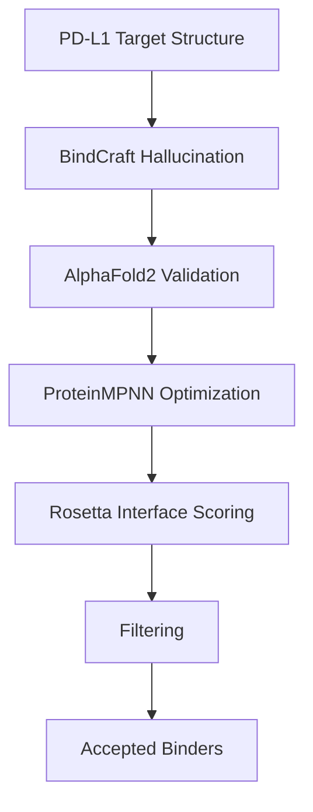
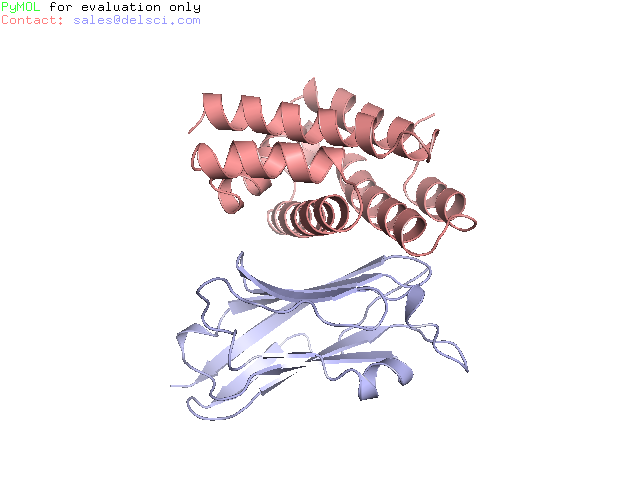
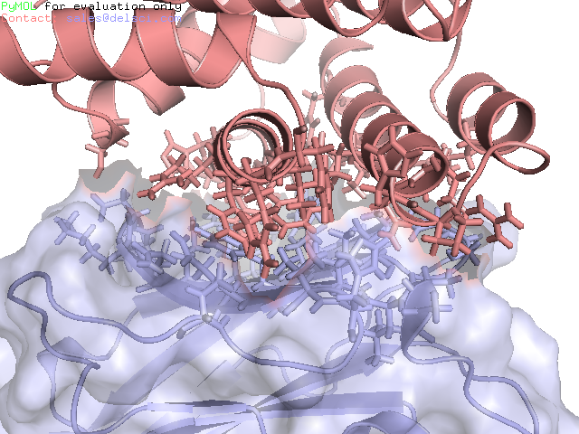

# AI-Driven PD-L1 Binder Design Using BindCraft

## Project Goal

Design de novo protein binders against PD-L1 using BindCraft and evaluate candidate quality using AlphaFold2, ProteinMPNN, and Rosetta-based filtering.

This project was completed as part of my hands-on exploration of modern AI protein design workflows.

---

## Why This Project?

As a protein engineer with 10 years of experience in antibody discovery and biologics development, I wanted to understand how modern generative protein design platforms can create target-specific binders without relying on traditional antibody discovery campaigns.

PD-L1 was selected as a model target due to its importance in cancer immunotherapy.

---

## Workflow



---

## Computational Environment

| Item                 | Value                 |
| -------------------- | --------------------- |
| Platform             | RunPod                |
| GPU                  | RTX 4090              |
| Storage              | 100 GB Network Volume |
| Design Framework     | BindCraft             |
| Structure Validation | AlphaFold2            |
| Sequence Design      | ProteinMPNN           |
| Interface Scoring    | Rosetta               |

---

## Results

### Design Campaign Summary

| Metric                  | Value |
| ----------------------- | ----- |
| Total Designs Evaluated | 98    |
| Accepted Designs        | 7     |
| Rejected Designs        | 91    |
| Acceptance Rate         | 7.1%  |

### Top Candidate

| Metric                        | Value                   |
| ----------------------------- | ----------------------- |
| Design                        | PDL1_l136_s216931_mpnn1 |
| pLDDT                         | 0.95                    |
| Binder pLDDT                  | 0.96                    |
| Interface pTM                 | 0.86                    |
| Interface pAE                 | 0.16                    |
| Predicted Binding Energy (dG) | -45.42                  |

### Top Candidate Structure

## Binding Interface

---

## Key Observation

Most accepted designs were highly alpha-helical despite large differences in sequence length.

This suggests that the BindCraft design pipeline strongly favors compact helical scaffolds, likely due to their structural stability and favorable AlphaFold2 confidence scores.

As a follow-up analysis, I plan to compare these binders with antibody-based PD-L1 recognition modes and evaluate their developability properties.

---

## Repository Contents

```text
results/
├── final_design_stats.csv
├── trajectory_stats.csv

structures/
├── PDL1_l136_s216931_mpnn1_model1.pdb
└── PDL1_l136_s216931_mpnn3_model1.pdb

images/
├── top_binder_complex.png
└── top_binder_complex2.png

```

---

## Future Work

* Structural analysis in PyMOL
* Interface residue analysis
* Comparison with antibody paratopes
* ESM3-guided sequence diversification
* Experimental validation
